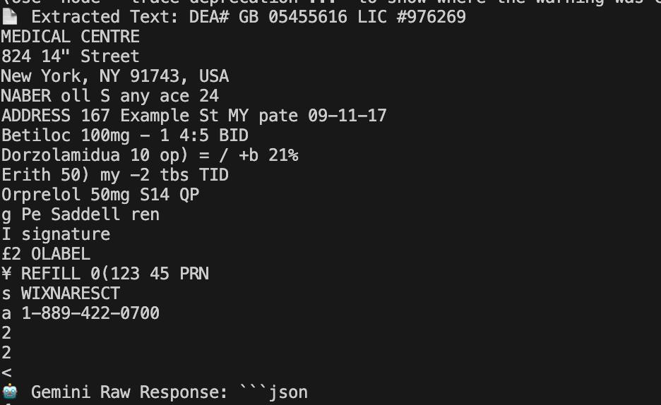
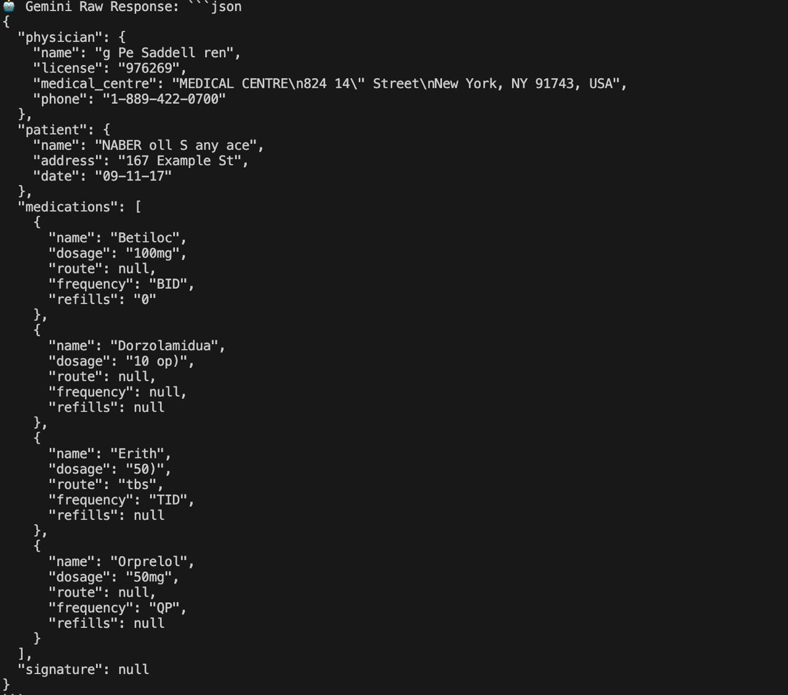
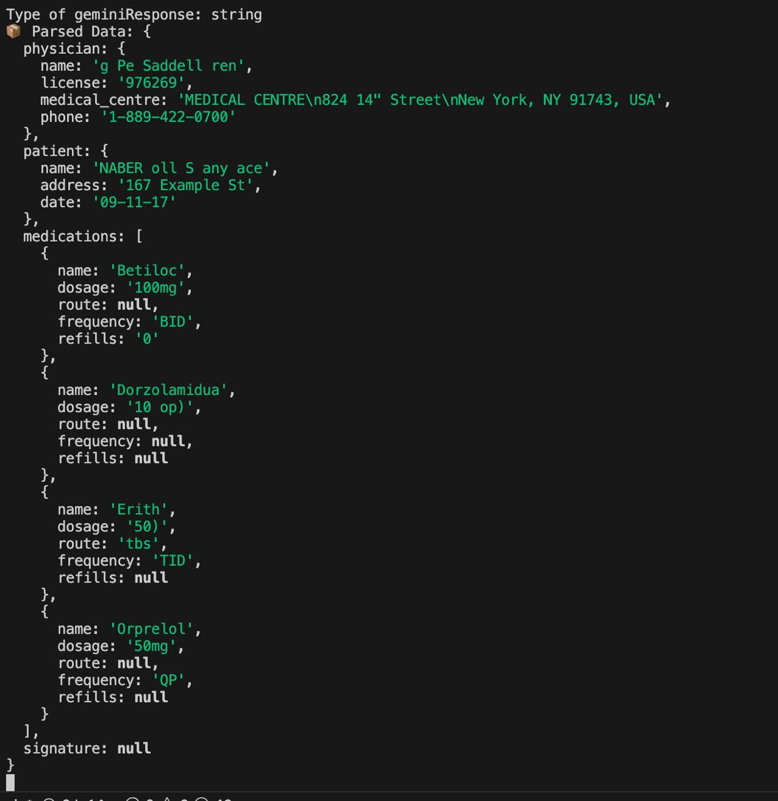

# Vewha Project Details

## Environment Dependencies
- Android Studio version: "AI-242.23726.103.2422.12816248"
    - JAVA_VERSION: "21.0.4" (add env var JAVA_HOME = /path/to/AndroidStudio/jbr)
    - gradle-wrapper: "8.5" (distribution-url:8.7)
    - kotlin_version = '2.1.0' (min req for gradle 8.5)
- Flutter version: "3.27.2"
    - google-services: "4.4.2"

## LLM Usage

