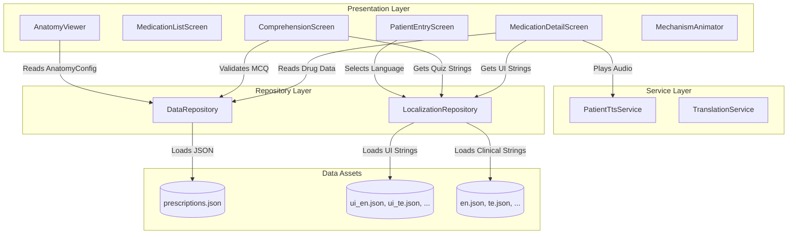

# VEWHA Final Architecture

```mermaid
graph TD
    %% Presentation Layer
    subgraph Presentation Layer
        A[PatientEntryScreen]
        B[MedicationListScreen]
        C[MedicationDetailScreen]
        D[ComprehensionScreen]
        E[AnatomyViewer]
        F[MechanismAnimator]
    end

    %% Service Layer
    subgraph Service Layer
        G[PatientTtsService]
        H[TranslationService]
    end

    %% Repository Layer
    subgraph Repository Layer
        I[DataRepository]
        J[LocalizationRepository]
    end

    %% Data Source Layer
    subgraph Data Assets
        K[(prescriptions.json)]
        L[(ui_en.json, ui_te.json, ...)]
        M[(en.json, te.json, ...)]
    end

    %% Connections
    C -->|Reads Drug Data| I
    C -->|Plays Audio| G
    C -->|Gets UI Strings| J
    D -->|Validates MCQ| I
    D -->|Gets Quiz Strings| J
    E -->|Reads AnatomyConfig| I
    A -->|Selects Language| J
    
    I -->|Loads JSON| K
    J -->|Loads UI Strings| L
    J -->|Loads Clinical Strings| M
```
