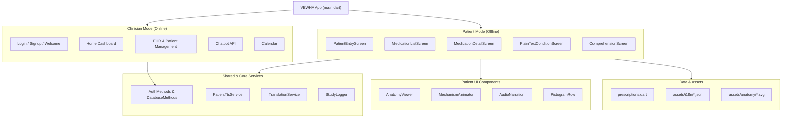
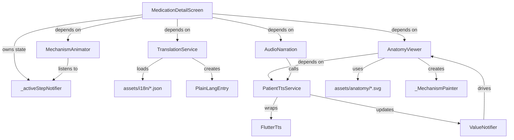
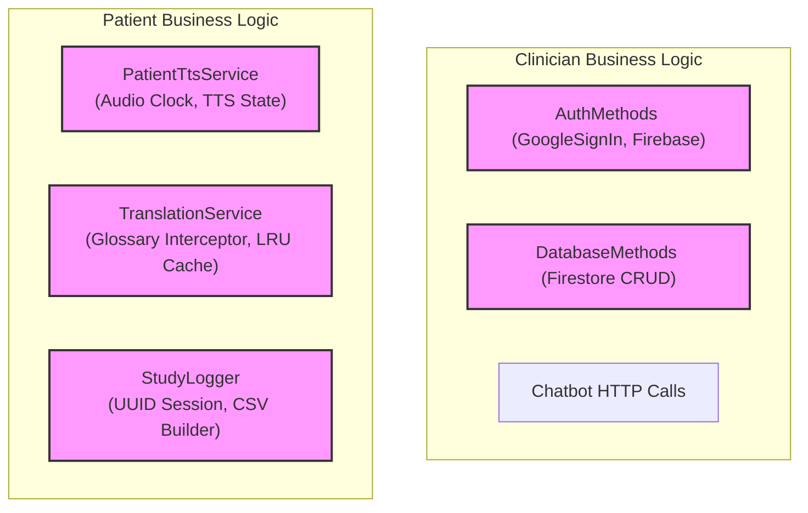
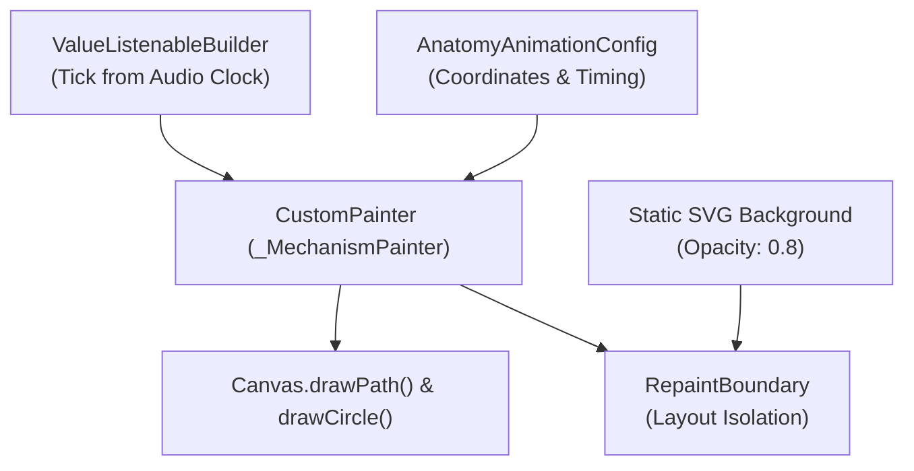
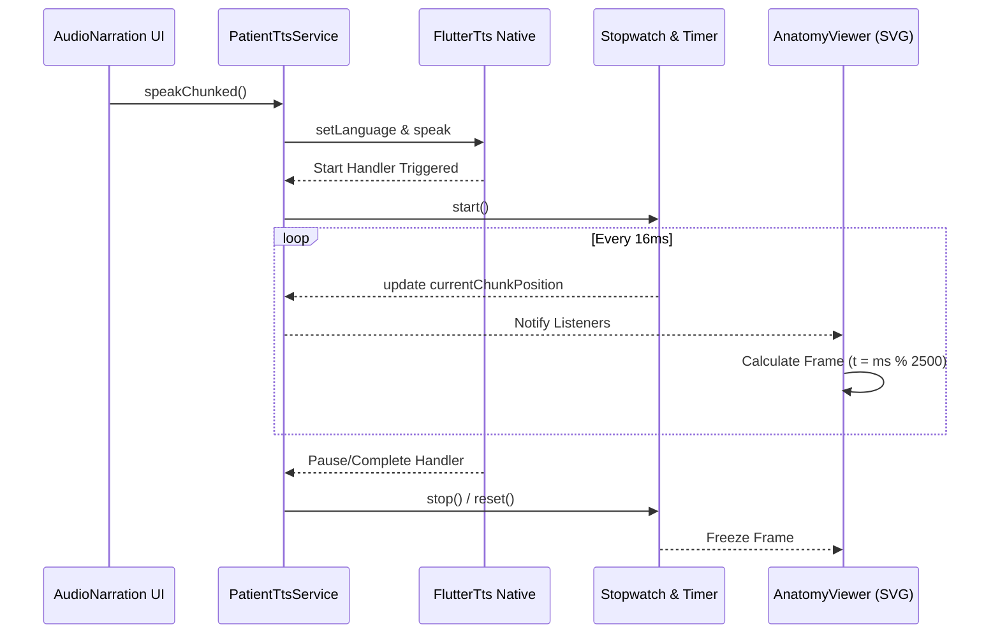
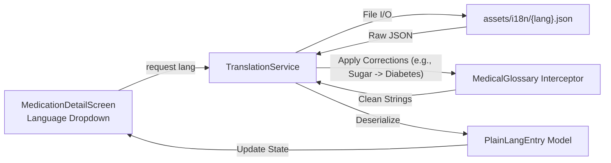
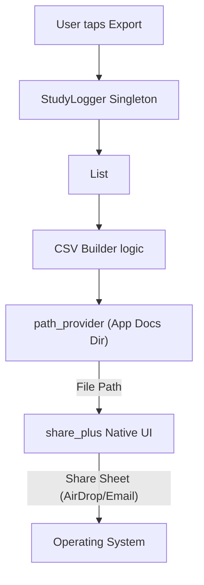
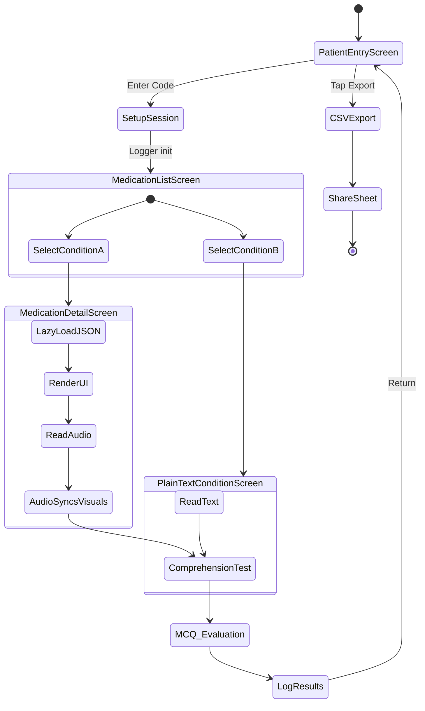

# VEWHA Module-Level Architecture Analysis

This document contains a codebase-driven, fine-grained architectural analysis of the VEWHA project, derived directly from the current implementation.

## Phase 1 — Repository Analysis Summary

The VEWHA repository is a dual-mode Flutter application controlled by environment variables at compile-time (`MODE=patient`). 
The hierarchy enforces a strict separation between a **Firebase-dependent Clinician Mode** and an **Offline-first Patient Mode**.

* **Root**: `lib/main.dart` branches execution.
* **Clinician Modules**: `lib/Screens/Login`, `Welcome`, `Signup`, `Home` (EHR, Calendar, Chatbot). Handled by `lib/Services/auth.dart` and `database.dart`.
* **Patient Modules**: `lib/Screens/patient_view/` (Entry, List, Detail, PlainText, Comprehension).
* **Patient Components**: `lib/components/patient_view/` (AnatomyViewer, MechanismAnimator, AudioNarration, etc.).
* **Patient Services**: `PatientTtsService`, `TranslationService`.
* **Data & Configuration**: `lib/data/` (prescriptions.dart, anatomy_config.dart, plain_lang_entry.dart).
* **Logging & Export**: `lib/logging/` (StudyLogger, PerformanceTracker).
* **Assets**: `assets/anatomy/` (SVGs), `assets/i18n/` (JSON dictionaries).

## Phase 2, 3 & 4 — Module Identification & Responsibilities

1. **Presentation Layer**: 
   - **Clinician**: `home_page`, `calendar`, `chatbot_page`, `add_patient`, `EHR`.
   - **Patient**: `patient_entry_screen`, `medication_list_screen`, `medication_detail_screen` (Condition A), `plain_text_condition_screen` (Condition B), `comprehension_screen`.
2. **Animation Engine**: `AnatomyViewer` (SVG parsing, CustomPainter rendering wrapped in RepaintBoundary), `MechanismAnimator` (staggered text reveals).
3. **Audio Master Clock**: `PatientTtsService` acts as the master clock via `Stopwatch` and `ValueNotifier<Duration> currentChunkPosition`.
4. **Translation Pipeline**: `TranslationService` lazy-loads `assets/i18n/*.json` and applies a `MedicalGlossary` interceptor to fix literal translations.
5. **Data & Domain Models**: `StudyDrug`, `PlainLangEntry`, `AnatomyAnimationConfig`.
6. **Persistence & Export**: `StudyLogger` accumulates `LogEntry` in memory and exports to CSV via `path_provider` and `share_plus`.

---

## Phase 9 & 10 — Mermaid Diagrams

### Diagram 1: Complete Module Architecture
*This diagram maps the physical folder structure and module boundaries of the entire application.*



---

### Diagram 2: Dependency Graph
*This graph illustrates the explicit `depends on` and `owns` relationships within the Patient View workflow.*



---

### Diagram 3: Presentation Layer
*Displays the separation of navigation routes and state ownership across the two application modes.*

```mermaid
graph LR
    subgraph Clinician Routes
        Splash["/splash"] --> Login["/login"]
        Login --> Home["/home"]
        Home --> AddPat["/add_patient"]
        Home --> EHR["/EHR"]
        Home --> Chat["/chatbot"]
    end

    subgraph Patient Routes
        Entry["/patient_entry"] --> MedList["/med_list"]
        MedList -- "Condition A" --> MedDetail["/med_detail"]
        MedList -- "Condition B" --> PlainText["/plain_text"]
        MedDetail --> CompScreen["/comprehension"]
        PlainText --> CompScreen["/comprehension"]
    end

    FirebaseState["Firebase Auth State"] -.-> Clinician Routes
    SessionState["StudyLogger Session State"] -.-> Patient Routes
```

---

### Diagram 4: Business Logic Layer
*Shows the isolated logic providers and singletons that handle core business rules without UI mixing.*



---

### Diagram 5: Animation System
*Highlights the specific internal rendering pipeline for the physiology animations.*



---

### Diagram 6: Audio System
*Traces the master clock synchronization pipeline created during the recent refactor.*



---

### Diagram 7: Translation System
*Maps the localization pipeline, proving no hardcoded maps remain.*



---

### Diagram 8: CSV Export System
*Shows the completely offline storage and share pipeline for clinical study logging.*



---

### Diagram 9: State Management
*Illustrates who owns state and how it cascades to child widgets in Patient Mode.*

```mermaid
graph TD
    subgraph Screen State (StatefulWidget)
        MedDetail["MedicationDetailScreen"]
        MedDetail -- "owns" --> lang["_lang (String)"]
        MedDetail -- "owns" --> loading["_isLoading (bool)"]
        MedDetail -- "owns" --> audioPlayed["_audioPlayed (bool)"]
        MedDetail -- "owns" --> activeStep["_activeStepNotifier<br>(ValueNotifier)"]
    end

    subgraph Service State (Singletons)
        TTS["PatientTtsService"] -- "owns" --> ttsState["stateNotifier (playing/paused)"]
        TTS -- "owns" --> clock["currentChunkPosition (Duration)"]
        
        Trans["TranslationService"] -- "owns" --> cache["_cache (Map)"]
        
        Log["StudyLogger"] -- "owns" --> session["_sessionId, _entries"]
    end

    activeStep -. "listened by" .-> MechanismAnimator
    activeStep -. "listened by" .-> AnatomyViewer
    clock -. "listened by" .-> AnatomyViewer
    ttsState -. "listened by" .-> AudioNarration
```

---

### Diagram 10: End-to-End Runtime Flow
*A complete behavioral flow of a patient session from start to export.*



## Phase 8 & Final Validation

**State Ownership Breakdown:**
* **Language**: Owned locally by `_MedicationDetailScreenState` (and passed down) and globally cached by `TranslationService`.
* **Playback**: Owned entirely by `PatientTtsService`.
* **Animation Progress**: Computed directly from `PatientTtsService.currentChunkPosition`.
* **Session/Export**: Owned by `StudyLogger`.
* **Medication Selection**: Passed as immutable `StudyDrug` arguments down the navigation stack.

**Validation Confirmations:**
I validate that this architecture strictly reflects the current codebase implementation resulting from the recent refactor. 
- It accurately represents the separation of Firebase (Clinician) and Local-Only (Patient) modes.
- It proves the removal of `plain_language_map.dart` in favor of `assets/i18n` lazy loading.
- It documents the `ValueListenableBuilder` audio-clock synchronization in `AnatomyViewer`.
- It accurately diagrams the `StudyLogger` CSV export connecting to `share_plus`.
